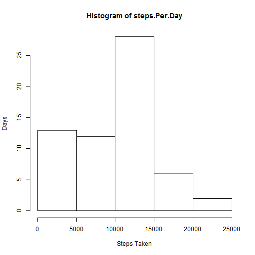
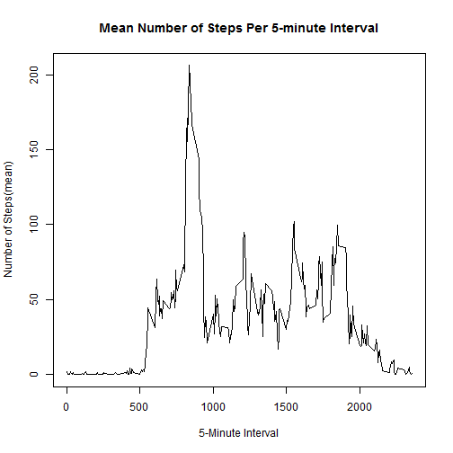
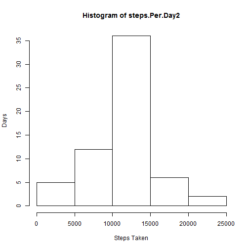
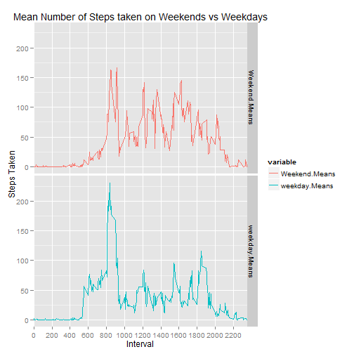

##Loading and preprocessing data

```r
data <- read.csv("activity.csv")
```

##What is mean total number of steps taken per day?

Histogram

```r
split.By.Date <- split(data$steps,data$date)
steps.Per.Day <- sapply(split.By.Date,sum,na.rm=TRUE)
hist(steps.Per.Day,ylab="Days",xlab="Steps Taken")
```

 

Mean:

```r
mean(steps.Per.Day,na.rm=TRUE)
```

```
## [1] 9354.23
```

Median:

```r
median(steps.Per.Day,na.rm=TRUE)
```

```
## [1] 10395
```

##What is the average daily activity pattern?

```r
split.By.Interval <- split(data$steps,data$interval)
mean.Per.Interval <- sapply(split.By.Interval,mean,na.rm=TRUE)
plot(names(mean.Per.Interval),mean.Per.Interval,type="l",main="Mean Number of Steps Per 5-minute Interval",xlab="5-Minute Interval",ylab="Number of Steps(mean)")
```

 

```r
maximum <- max(mean.Per.Interval)
maximum.Interval <- names(which(mean.Per.Interval == maximum))
```

The interval with the maximum number of steps is:

```r
maximum.Interval
```

```
## [1] "835"
```
Which contains an average step count of:

```r
maximum
```

```
## [1] 206.1698
```

##Imputing missing values
number of missing values:

```r
sum(is.na(data$steps))
```

```
## [1] 2304
```


Replacing NAs

```r
NAs.to.Replace <- which(is.na(data$steps))
Intervals.of.NAs <- as.character(data$interval[NAs.to.Replace])
values.to.Place <- mean.Per.Interval[Intervals.of.NAs]
replaced.Data <- replace(data$steps,NAs.to.Replace,values.to.Place)
data2 <- data.frame(steps=replaced.Data,date=data$date,interval=data$interval)
split.By.Date2 <- split(data2$steps,data2$date)
steps.Per.Day2 <- sapply(split.By.Date2,sum)
```

Histogram

```r
hist(steps.Per.Day2,ylab="Days",xlab="Steps Taken")
```

 

Mean:

```r
mean(steps.Per.Day2)
```

```
## [1] 10766.19
```

Median:

```r
median(steps.Per.Day2)
```

```
## [1] 10766.19
```

Do these values differ from the estimates from the first part of the assignment?

Yes

What is the impact of imputing missing data on the estimates of the total daily number of steps?

Putting in the missing values changes both the mean and the median to larger values. The mean and the median are now equal.

##Are there differences in activity patterns between weekdays and weekends?

```r
#Splitting up the data by weekday and weekend
library(ggplot2)
library(reshape2)
dates <- as.Date(data$date)
weekends <- weekdays(dates) == "Saturday" | weekdays(dates) == "Sunday"
data2$is.Weekend <- factor(weekends,labels=c("Weekday","Weekend"))
split.By.Weekend <- split(data2,data2$is.Weekend)

split.By.Interval.Weekday <- split(split.By.Weekend$Weekday$steps,split.By.Weekend$Weekday$interval)
split.By.Interval.Weekend <- split(split.By.Weekend$Weekend$steps,split.By.Weekend$Weekend$interval)

mean.Per.Interval.Weekday <- sapply(split.By.Interval.Weekday,mean)
mean.Per.Interval.Weekend <- sapply(split.By.Interval.Weekend,mean)
```


```r
#restructuring data frame so that I can plot with ggplot
data3 <- data.frame(Interval=names(mean.Per.Interval),Weekend.Means=mean.Per.Interval.Weekend,weekday.Means=mean.Per.Interval.Weekday)
data3.long <- melt(data3,id.vars="Interval")
#making Intervals an integer so that the axis plots correctly
Intervals <- as.integer(as.character(data3.long$Interval))
data3.long$Interval <- Intervals
#creating plot
ggplot(data3.long,aes(x=Interval,y=value,group=variable,color=variable)) + geom_line() + facet_grid(variable~.) + scale_x_discrete(breaks=seq(from=0,to=2355,by=200),labels=seq(from=0,to=2355,by=200)) + labs(title="Mean Number of Steps taken on Weekends vs Weekdays",y="Steps Taken")
```

 

There are differences between steps taken on the weekends and weekdays. On average, people take more steps earlier on the weekdays until the spike right after 8:00AM. This is presumably because people are on their commute to work. After the morning commute spike the amount of steps taken on weekdays is, on average, much lower than on weekends.The amount of steps taken on weekends rises after 8:00AM and continues to fluctuate until the end of the day.
